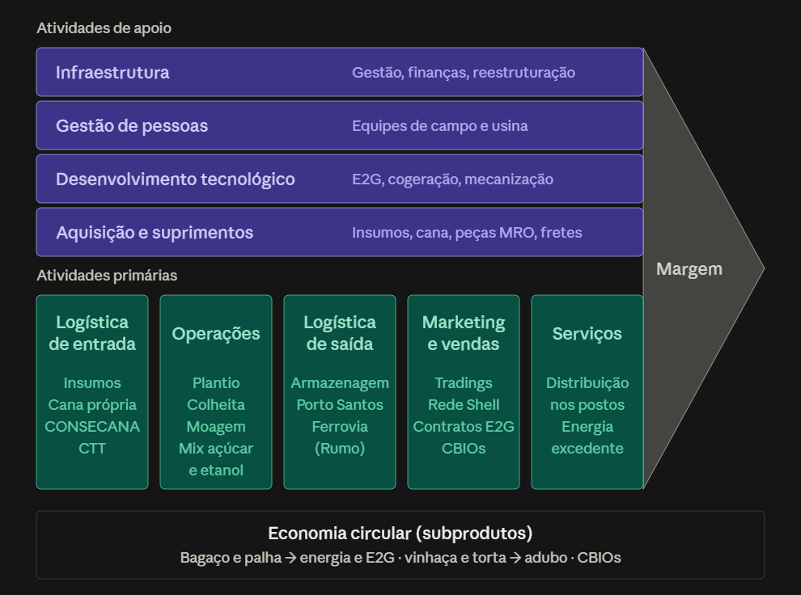

# Cadeia de valor e operação agroindustrial

## Visão geral

A cadeia da Raízen no setor sucroenergético segue um fluxo linear, com subprodutos que voltam para dentro da própria operação:

Fornecedores de insumos e de cana → Operação agrícola → Operação industrial → Subprodutos → Logística e comercialização → Clientes finais

**Principais agentes e fluxos:**

- **Fornecedores:** entregam mudas, fertilizantes, defensivos, máquinas, combustível e mão de obra. Parte da cana vem de produtores independentes, pagos pelo modelo CONSECANA (com base no ATR entregue e nos preços do açúcar e do etanol).
- **Operação agrícola:** produz a cana em terra própria ou arrendada e faz a colheita e o transporte até a usina (CTT: Corte, Transbordo e Transporte).
- **Operação industrial:** moe a cana e decide o mix entre açúcar (VHP ou cristal) e etanol (hidratado ou anidro).
- **Subprodutos (economia circular):** o bagaço e a palha viram energia (cogeração) ou etanol de segunda geração (E2G). A vinhaça e a torta de filtro voltam ao campo como adubo. As emissões evitadas geram créditos de carbono (CBIOs).
- **Logística e comercialização:** armazenagem para vender na entressafra, exportação via Porto de Santos (rodovia + ferrovia, com a Rumo) e distribuição no mercado interno, incluindo a rede Shell da própria Raízen.
- **Clientes finais:** indústrias de alimentos e bebidas, tradings e refinarias no exterior (açúcar); consumidores nos postos e distribuidoras (etanol); clientes internacionais com contratos longos (E2G); mercado elétrico (energia); distribuidoras de combustíveis (CBIOs).

## Etapas da operação

| Etapa | Atividades principais | Entradas | Saídas | Riscos de continuidade | Relação com manutenção e Suprimentos |
|---|---|---|---|---|---|
| Agrícola | Preparo e plantio (5 a 6 cortes por canavial antes da renovação), tratos culturais (adubação, fertirrigação com vinhaça, controle de pragas), colheita mecanizada e CTT | Mudas, fertilizantes (especialmente nitrogênio), defensivos, combustível, colhedoras, transbordos, caminhões, mão de obra, cana de fornecedores independentes | Cana colhida entregue na usina; indicadores de TCH e ATR | Seca, geada, queimadas e excesso de chuva (moagem caiu de 30,9 para 24,5 mi t no 1T 2025/26); envelhecimento do canavial; quebra de colhedoras ou caminhões em plena safra | Frota grande e crítica (cerca de 750 caminhões por safra) exige peças de reposição e manutenção rápida; Suprimentos garante fertilizantes, defensivos e combustível no momento certo do ciclo agrícola |
| Industrial | Recepção (pesagem e análise de ATR), preparo e moagem, tratamento do caldo, decisão de mix, rota açúcar (evaporação, cozimento, cristalização, secagem) e rota etanol (fermentação, destilação), cogeração e E2G | Cana, água, leveduras, insumos químicos, bagaço e palha (para caldeiras e E2G), peças e materiais de manutenção | Açúcar VHP e cristal, etanol hidratado e anidro, E2G, energia elétrica, vinhaça e torta de filtro | Parada de moendas, caldeiras ou destilarias; falta de cana para ocupar a usina (custo fixo alto); menor biomassa reduz a cogeração | Indicador de horas paradas depende da manutenção; Suprimentos precisa ter estoque MRO de peças críticas, já que uma parada na safra interrompe uma operação 24h; com menos usinas (de 30 para 24), cresce a discussão sobre onde manter e centralizar esses estoques |
| Logística | Entrada (cana do campo para a usina em janelas sincronizadas) e saída (armazenagem, transporte rodoferroviário até Santos, envio às bases de distribuição e postos) | Caminhões, contratos ferroviários (Rumo, R$ 916 mi), terminais portuários, tanques e armazéns | Açúcar e etanol entregues a clientes no Brasil e no exterior; estoques para a entressafra | Cana precisa ser moída logo após o corte (perde açúcar); gargalos em rodovia, ferrovia ou porto; falta de capacidade de armazenagem | Manutenção da frota própria e dos ativos de armazenagem; Suprimentos negocia fretes, contratos e nível de serviço com operadores logísticos |

## Sazonalidade e integração

A safra dura cerca de 8 meses, mas o consumo de açúcar e etanol acontece o ano todo. Por isso, a operação vive dois ritmos diferentes:

- **Na safra:** colheita, transporte e moagem funcionam juntos, 24 horas por dia. As etapas são muito dependentes umas das outras: se a colheita para, a usina fica sem cana; se a usina para, a cana colhida perde açúcar. Qualquer falha se espalha pela cadeia rapidamente.
- **Na entressafra:** a usina deixa de moer e a empresa passa a viver dos estoques. Decidir quanto etanol guardar para vender nesse período, quando o preço costuma subir, é uma escolha comercial importante. É também a janela natural para manutenções maiores nas usinas.

A integração ajuda a reduzir riscos. A Raízen produz e distribui combustível (rede Shell), o que dá visibilidade da demanda. A flexibilidade de mix permite trocar açúcar por etanol conforme o preço. Os subprodutos voltam para dentro da operação como energia e adubo, reduzindo a compra de insumos. Por outro lado, essa integração também cria dependência: problemas no campo (clima, canavial envelhecido) afetam a indústria, a cogeração e o E2G ao mesmo tempo.

## Pontos críticos

- **Colheita e transporte (CTT):** quebra de colhedoras, transbordos ou caminhões interrompe o abastecimento da usina, e a cana parada perde ATR.
- **Moagem:** a moenda é o coração da usina. Uma parada para toda a produção de açúcar, etanol, energia e E2G.
- **Caldeiras e cogeração:** sem caldeira não há vapor nem energia para a própria usina, o que interrompe a operação industrial.
- **Fermentação e destilação:** falhas afetam diretamente a produção de etanol e a capacidade de ajustar o mix.
- **Insumos agrícolas:** atraso na entrega de fertilizantes e defensivos compromete a produtividade da safra seguinte (TCH e ATR).
- **Peças de reposição (MRO):** em uma operação 24h na safra, a falta de uma peça crítica pode parar a usina. Com menos usinas e alta diversidade de materiais, a localização dos estoques (local ou centralizada) se torna decisiva.
- **Logística de saída:** gargalos na ferrovia, rodovia ou porto de Santos travam a exportação e lotam a armazenagem.

---

## Fontes

- AEGRO. Atr da cana-de-açúcar. 2024. Disponível em: aegro.com.br/tags/atr-da-cana-de-acucar/. Acesso em: 03/10/2026.
- AGROADVANCE. Como é calculado o preço do ATR no CONSECANA-SP? 2025. Disponível em: agroadvance.com.br/blog-consecana-preco-do-atr/. Acesso em: 03/10/2026.
- CANA ONLINE. Ciclo da cana-de-açúcar: matéria-prima é 100% aproveitada no setor sucroenergético. 2021. Disponível em: canaonline.com.br/conteudo/ciclo-da-cana-de-acucar-materia-prima-e-100-aproveitada-no-setor-sucroenergetico.html. Acesso em: 03/10/2026.
- CZAPP. Como é calculado o preço do kg de ATR pelo Consecana? 2024. Disponível em: czapp.com/explainers/como-e-calculado-o-preco-do-kg-de-atr-pelo-consecana/. Acesso em: 03/10/2026.
- EMBRAPA. Adubação: resíduos alternativos. s.d. Disponível em: embrapa.br/web/agencia-de-informacao-tecnologica/cultivos/cana-de-acucar/producao/correcao-e-adubacao/diagnose-das-necessidades-nutricionais/recomendacao-de-correcao-e-adubacao/adubacao-residuos-alternativos. Acesso em: 03/10/2026.
- EMBRAPA. Outros produtos. s.d. Disponível em: embrapa.br/en/agencia-de-informacao-tecnologica/cultivos/cana-de-acucar/pos-producao/processamento-da-cana-de-acucar/outros-produtos. Acesso em: 03/10/2026.
- INVESTNEWS. Recuperação extrajudicial da Raízen pode afetar outras empresas na bolsa, da JSL a MRS Logística. 2026. Disponível em: investnews.com.br/investimentos/recuperacao-da-raizen-pode-afetar-outras-empresas-na-bolsa-da-jsl-a-mrs-logistica/amp/. Acesso em: 03/10/2026.
- PLANETA CAMPO. O caminho da cana: da lavoura aos produtos que fazem parte do nosso dia a dia. 2025. Disponível em: planetacampo.canalrural.com.br/agricultura/cana-lavoura-produtos-fazem-parte-dia-a-dia/. Acesso em: 03/10/2026.